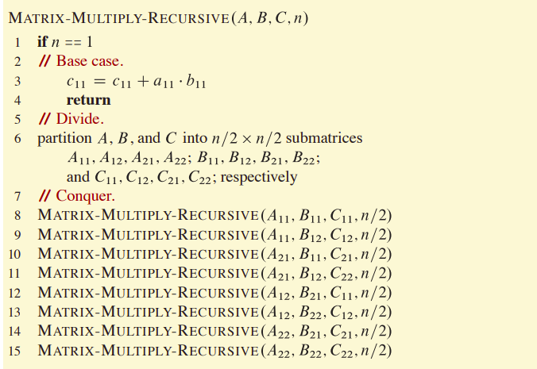
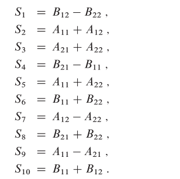
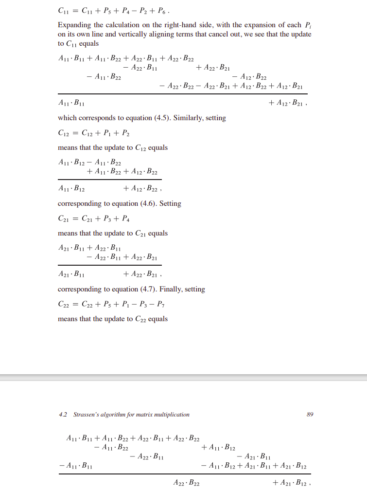
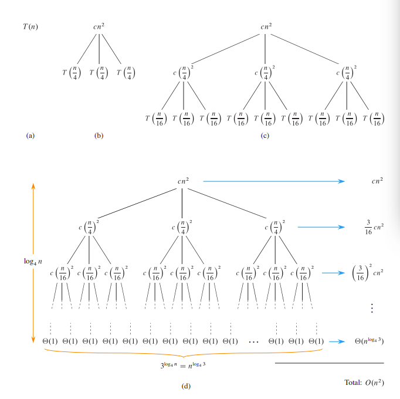
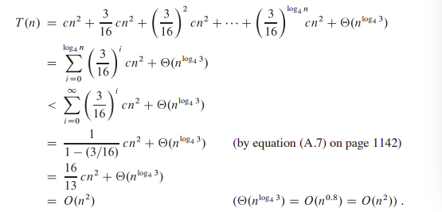
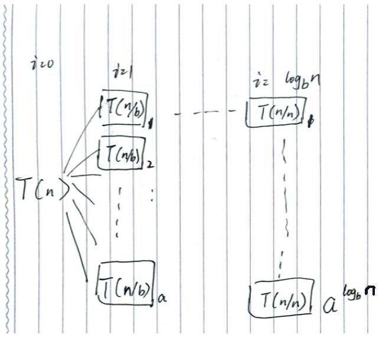
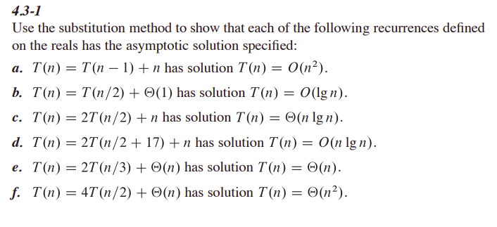

# 第四章 分治法

## Part 1 分治策略
实现策略分三步：
1. Divide 分解问题
2. Conquer 递归地求解子问题
3. 结合基础结论or计算得出结果

分治策略可以用递归的方式实现
递归实现的样式：  
```
function:
    //基本情况的结果(触底后向上)
    if base case:
        do...

    
    //进入子问题并求解(向下)
    else if recursion case:
        function 
        ...

    //必要的运算后得出结果(向上)
    make the result
    return result
```
## Part 2 矩阵乘法的Strassen算法
**一般算法：**  
  
  
    
**Strassen算法的思路：**  
$$ 
a^2-b^2 = (a+b)*(a-b)
$$

**Strassen的做法**  
1. 把每个矩阵拆成四个矩阵  

2. 计算10个矩阵加法，产生10个新矩阵   
 
3. 计算7个矩阵乘法(递归)，产生7个新矩阵    

4. 计算好多个矩阵加法，修改原矩阵的内容  


该算法时间复杂度的递推式如下图：  
  
书上所说：Strassen算法的时间复杂度为：  
$$
T(n) = \Theta(n^{\log_2 7}) 
$$
## Part 3 分治法的时间复杂度分析  
**递归树**  
栗子:  
$$
T(n) = 3T(n/4)+cn^2
$$
  


### 问题1： 仿照上面的推导，能否类似画出strassen算法的递归树，求出strassen的时间复杂度？
尝试推导通式：  
$$
T(n)=aT(n/b)+cn^d
$$
画图  
  
有：    
$$
T(n) = a^{\log_b n}T(1) + \Sigma_{i=0}^{\log_b n -1}[c(n/b^i)^d~a^{i}]
$$
提取系数：  
$$
T(n) = c_2 n^{\log_b a} + c n^d 
\Sigma_{i=0}^{\log_b n -1}(a/b^d)^i
$$
**若(a/b^d = 1),则：**  
$$
T(n) = c_2 n^d +cn^d\log_b n = \Theta(n^d\log_b n)
$$
否则，等比数列求和：  
$$
T(n) =  c_2 n^{log_b a} + c_1 n^d[1-(a/b^d)^{\log_b n}]/(1-a/b^d)
$$
化简：  
$$
T(n) =  c_2 n^{log_b a} + c_1/(1-a/b^d)~ n^d[1-(a/b^d)^{\log_b n}]
$$

$$
T(n) =  c_2 n^{log_b a} + c_1/(1-a/b^d)~ n^d[1-n^{\log_b a -d}]
$$
$$
T(n) =  c_2 n^{log_b a} + c_1/(1-a/b^d)~ n^d - c_1/(1-a/b^d)n^{\log_b a} 
$$
$$
T(n) =  [1- c_1/(1-a/b^d)]~ n^d - c_1/(c_2-a/b^d)n^{\log_b a} 
$$


#### 重点(判断符号)  
**当a < b^d,即\log_b a < d:**  
(1-a/b^d) < 0
$$
T(n) = \Theta(n^d)
$$

**当a > b^d,即\log_b a > d:**  
(1-a/b^d) > 0
$$
T(n) = \Theta(n^{\log_a b})
$$

而这，就是**4-5中的主方法**的结论  

Strassen算法通过减少树的分支(bush)使得计算量下降  
下面是一些常见的形式，代入上面的式子也能得到相应的形式：


## Part 4 主方法的证明(没那个能力,故略)